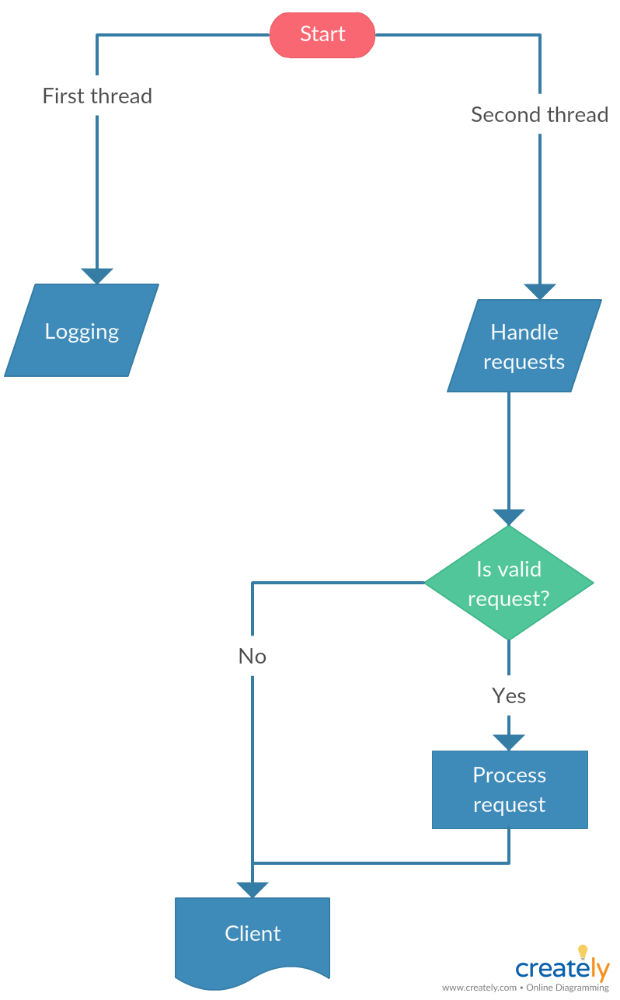
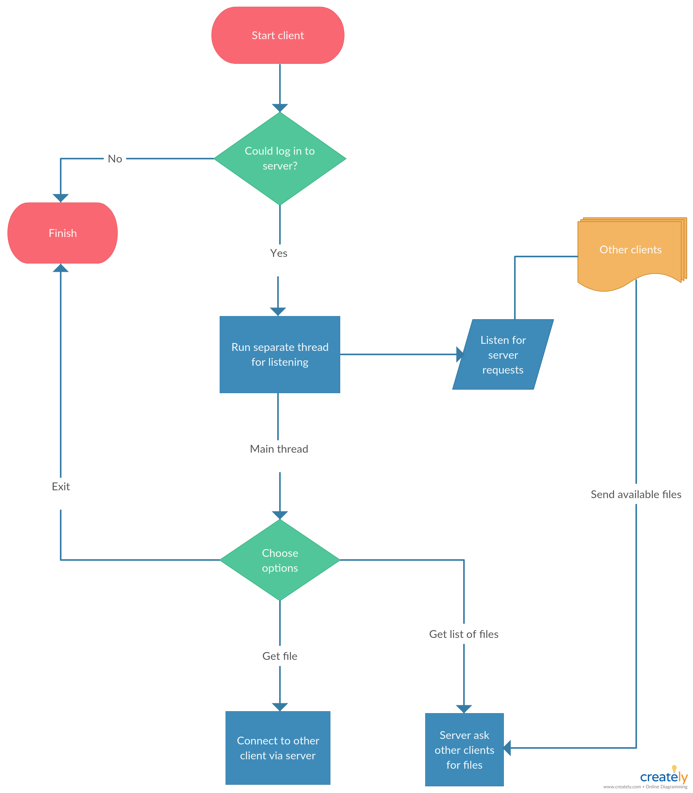
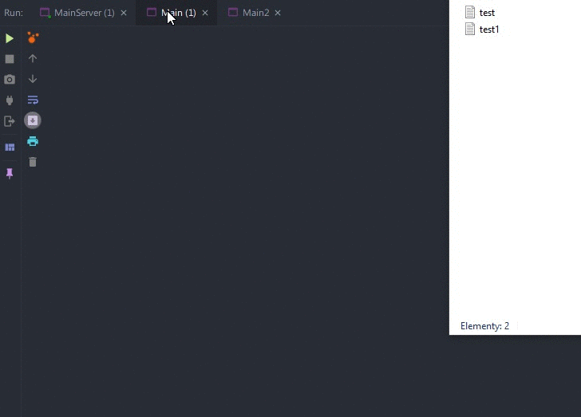

# e-goat
P2P file transfer using UDP protocol

## Architecture of the program

1. Client logs to server which is always running (main thread for client)
2. Client who has logged to server runs second thread for listening to requests from server
3. Client in main thread select option
    - `GET_LIST_OF_FILES` 
        - client sends message to get all available files from all other clients
        - server receives message and asks each client for files (on client listen port)
        - server sends list of files to the client
    - `GET_FILES` (after client decides to choose which file to dowload)
        - client sends request to server with name of file and name of client who has this file
        - server asks client with file to send the file to the client who asked for it
        - clients start transfering files
    - `EXIT` 
        - terminate program 
  

  
  

## Usage 

## Installation 

### Authors
Robert Jankowski [@robertjankowski](https://github.com/robertjankowski)

Łukasz Bożek     [@xxlukasz11](https://github.com/xxlukasz11)
